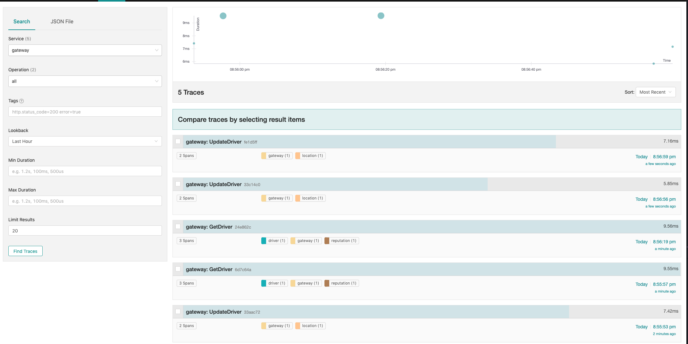

### Building services

Just simply `go build -o outputbinary` within `driver` /  `gateway` / `location` / `reputation` directory.

### Building Docker image

Just simply `docker build -f serviceName.Dockerfile -t serviceName .`

### Deploying using Docker Compose

Run the stack using `docker-compose up -d`

This will create several containers:
  - nsqlookupd, nsqd and nsqadmin containers for NSQ,
  - initial container that'll create a topic in NSQ,
  - jaeger-collector for tracing,
  - gateway
  - driver
  - reputation
  - location

After all containers have started you can access several containers from your machine through:
  - Jaeger UI at http://localhost:16686/search
  - NSQ admin at http://localhost:4171/
  - Gateway service at http://localhost:8080

To see if everything works correctly perform the following cURLs:

```
➜  curl localhost:8080/drivers/1 -v
*   Trying ::1...
* TCP_NODELAY set
* Connected to localhost (::1) port 8080 (#0)
> GET /drivers/1 HTTP/1.1
> Host: localhost:8080
> User-Agent: curl/7.54.0
> Accept: */*
>
< HTTP/1.1 200 OK
< Content-Type: application/json; charset=UTF-8
< Date: Tue, 28 May 2019 18:58:11 GMT
< Content-Length: 48
<
* Connection #0 to host localhost left intact
{"ID":1,"Name":"Darryl Burke","Reputation":2.13}%
```

```
➜  curl -d '{"latitude": "48.8566", "longitude": "2.3522"}' -X PATCH localhost:8080/drivers/1 -v
*   Trying ::1...
* TCP_NODELAY set
* Connected to localhost (::1) port 8080 (#0)
> PATCH /drivers/1 HTTP/1.1
> Host: localhost:8080
> User-Agent: curl/7.54.0
> Accept: */*
> Content-Length: 46
> Content-Type: application/x-www-form-urlencoded
>
* upload completely sent off: 46 out of 46 bytes
< HTTP/1.1 200 OK
< Content-Type: application/json; charset=UTF-8
< Date: Tue, 28 May 2019 18:58:29 GMT
< Content-Length: 2
<
* Connection #0 to host localhost left intact
{}%
```

Now if you go to the Jaeger UI and select "gateway" service you should see two traces.



If you wish to see some metrics from Prometheus you can access Prometheus HTTP endpoint at ports:
- 8000 for gateway,
- 8001 for driver,
- 8002 for reputation,
- 8003 for location.

Example:

```
➜  curl localhost:8001/metrics
# HELP driver_get_driver_durations Durations of GetDriver requests
# TYPE driver_get_driver_durations summary
driver_get_driver_durations{quantile="0.5"} 0.0059996
driver_get_driver_durations{quantile="0.9"} 0.0072126
driver_get_driver_durations{quantile="0.99"} 0.0072126
driver_get_driver_durations_sum 0.0188832
driver_get_driver_durations_count 3
# HELP driver_get_driver_responses_2xx 2xx responses
# TYPE driver_get_driver_responses_2xx counter
driver_get_driver_responses_2xx 3
# HELP driver_get_driver_responses_5xx 5xx responses
# TYPE driver_get_driver_responses_5xx counter
driver_get_driver_responses_5xx 0
# HELP go_gc_duration_seconds A summary of the GC invocation durations.
# TYPE go_gc_duration_seconds summary
go_gc_duration_seconds{quantile="0"} 0
go_gc_duration_seconds{quantile="0.25"} 0
go_gc_duration_seconds{quantile="0.5"} 0
go_gc_duration_seconds{quantile="0.75"} 0
go_gc_duration_seconds{quantile="1"} 0
go_gc_duration_seconds_sum 0
go_gc_duration_seconds_count 0
# HELP go_goroutines Number of goroutines that currently exist.
# TYPE go_goroutines gauge
go_goroutines 10
# HELP go_info Information about the Go environment.
# TYPE go_info gauge
go_info{version="go1.12.5"} 1
# HELP go_memstats_alloc_bytes Number of bytes allocated and still in use.
# TYPE go_memstats_alloc_bytes gauge
go_memstats_alloc_bytes 1.02908e+06
# HELP go_memstats_alloc_bytes_total Total number of bytes allocated, even if freed.
# TYPE go_memstats_alloc_bytes_total counter
go_memstats_alloc_bytes_total 1.02908e+06
# HELP go_memstats_buck_hash_sys_bytes Number of bytes used by the profiling bucket hash table.
# TYPE go_memstats_buck_hash_sys_bytes gauge
go_memstats_buck_hash_sys_bytes 2952
# HELP go_memstats_frees_total Total number of frees.
# TYPE go_memstats_frees_total counter
go_memstats_frees_total 220
 HELP go_memstats_gc_cpu_fraction The fraction of this program's available CPU time used by the GC since the program started.
# TYPE go_memstats_gc_cpu_fraction gauge
go_memstats_gc_cpu_fraction 0
# HELP go_memstats_gc_sys_bytes Number of bytes used for garbage collection system metadata.
# TYPE go_memstats_gc_sys_bytes gauge
go_memstats_gc_sys_bytes 2.240512e+06
# HELP go_memstats_heap_alloc_bytes Number of heap bytes allocated and still in use.
# TYPE go_memstats_heap_alloc_bytes gauge
go_memstats_heap_alloc_bytes 1.02908e+06
# HELP go_memstats_heap_idle_bytes Number of heap bytes waiting to be used.
# TYPE go_memstats_heap_idle_bytes gauge
go_memstats_heap_idle_bytes 6.3995904e+07
# HELP go_memstats_heap_inuse_bytes Number of heap bytes that are in use.
# TYPE go_memstats_heap_inuse_bytes gauge
go_memstats_heap_inuse_bytes 2.523136e+06
# HELP go_memstats_heap_objects Number of allocated objects.
# TYPE go_memstats_heap_objects gauge
go_memstats_heap_objects 4464
# HELP go_memstats_heap_released_bytes Number of heap bytes released to OS.
# TYPE go_memstats_heap_released_bytes gauge
go_memstats_heap_released_bytes 6.3864832e+07
# HELP go_memstats_heap_sys_bytes Number of heap bytes obtained from system.
# TYPE go_memstats_heap_sys_bytes gauge
go_memstats_heap_sys_bytes 6.651904e+07
# HELP go_memstats_last_gc_time_seconds Number of seconds since 1970 of last garbage collection.
# TYPE go_memstats_last_gc_time_seconds gauge
go_memstats_last_gc_time_seconds 0
# HELP go_memstats_lookups_total Total number of pointer lookups.
# TYPE go_memstats_lookups_total counter
go_memstats_lookups_total 0
# HELP go_memstats_mallocs_total Total number of mallocs.
# TYPE go_memstats_mallocs_total counter
go_memstats_mallocs_total 4684
# HELP go_memstats_mcache_inuse_bytes Number of bytes in use by mcache structures.
# TYPE go_memstats_mcache_inuse_bytes gauge
go_memstats_mcache_inuse_bytes 6944
# HELP go_memstats_mcache_sys_bytes Number of bytes used for mcache structures obtained from system.
# TYPE go_memstats_mcache_sys_bytes gauge
go_memstats_mcache_sys_bytes 16384
# HELP go_memstats_mspan_inuse_bytes Number of bytes in use by mspan structures.
# TYPE go_memstats_mspan_inuse_bytes gauge
go_memstats_mspan_inuse_bytes 36864
# HELP go_memstats_mspan_sys_bytes Number of bytes used for mspan structures obtained from system.
# TYPE go_memstats_mspan_sys_bytes gauge
go_memstats_mspan_sys_bytes 49152
# HELP go_memstats_next_gc_bytes Number of heap bytes when next garbage collection will take place.
# TYPE go_memstats_next_gc_bytes gauge
go_memstats_next_gc_bytes 4.473924e+06
# HELP go_memstats_other_sys_bytes Number of bytes used for other system allocations.
# TYPE go_memstats_other_sys_bytes gauge
go_memstats_other_sys_bytes 1.297528e+06
# HELP go_memstats_stack_inuse_bytes Number of bytes in use by the stack allocator.
# TYPE go_memstats_stack_inuse_bytes gauge
go_memstats_stack_inuse_bytes 589824
# HELP go_memstats_stack_sys_bytes Number of bytes obtained from system for stack allocator.
# TYPE go_memstats_stack_sys_bytes gauge
go_memstats_stack_sys_bytes 589824
# HELP go_memstats_sys_bytes Number of bytes obtained from system.
# TYPE go_memstats_sys_bytes gauge
go_memstats_sys_bytes 7.0715392e+07
# HELP go_threads Number of OS threads created.
# TYPE go_threads gauge
go_threads 11
# HELP process_cpu_seconds_total Total user and system CPU time spent in seconds.
# TYPE process_cpu_seconds_total counter
process_cpu_seconds_total 0.35
# HELP process_max_fds Maximum number of open file descriptors.
# TYPE process_max_fds gauge
process_max_fds 1.048576e+06
# HELP process_open_fds Number of open file descriptors.
# TYPE process_open_fds gauge
process_open_fds 8
# HELP process_resident_memory_bytes Resident memory size in bytes.
# TYPE process_resident_memory_bytes gauge
process_resident_memory_bytes 1.0379264e+07
# HELP process_start_time_seconds Start time of the process since unix epoch in seconds.
# TYPE process_start_time_seconds gauge
process_start_time_seconds 1.55906964785e+09
# HELP process_virtual_memory_bytes Virtual memory size in bytes.
# TYPE process_virtual_memory_bytes gauge
process_virtual_memory_bytes 1.16760576e+08
# HELP process_virtual_memory_max_bytes Maximum amount of virtual memory available in bytes.
# TYPE process_virtual_memory_max_bytes gauge
process_virtual_memory_max_bytes -1
# HELP promhttp_metric_handler_requests_in_flight Current number of scrapes being served.
# TYPE promhttp_metric_handler_requests_in_flight gauge
promhttp_metric_handler_requests_in_flight 1
# HELP promhttp_metric_handler_requests_total Total number of scrapes by HTTP status code.
# TYPE promhttp_metric_handler_requests_total counter
promhttp_metric_handler_requests_total{code="200"} 0
promhttp_metric_handler_requests_total{code="500"} 0
promhttp_metric_handler_requests_total{code="503"} 0
```

### Deploying using minikube

Start the Minikube (e.g. `minikube start --vm-driver hyperkit`) and then apply the manifests:

```
kubectl apply -f k8s
```

Wait for containers to finish creating:

```
kubectl get pods -w
```

After all containers are in Running state proceed with:

```
kubectl apply -f k8s/driver
```

Check the minikube node IP address:

```
➜  kubectl get nodes -o wide
NAME       STATUS   ROLES    AGE     VERSION   INTERNAL-IP    EXTERNAL-IP   OS-IMAGE            KERNEL-VERSION   CONTAINER-RUNTIME
minikube   Ready    master   2m43s   v1.14.1   192.168.64.4   <none>        Buildroot 2018.05   4.15.0           docker://18.6.3
```

Then check ports that were assigned:

```
➜  kubectl get svc
NAME         TYPE        CLUSTER-IP       EXTERNAL-IP   PORT(S)             AGE
driver       ClusterIP   10.97.180.91     <none>        80/TCP              81s
gateway      NodePort    10.96.12.86      <none>        80:32128/TCP        81s
jaeger       ClusterIP   10.97.194.50     <none>        14268/TCP           2m3s
jaeger-ui    NodePort    10.111.192.250   <none>        16686:30019/TCP     2m3s
kubernetes   ClusterIP   10.96.0.1        <none>        443/TCP             3m30s
nsqadmin     NodePort    10.101.107.92    <none>        4171:31723/TCP      2m3s
nsqd         ClusterIP   10.98.185.93     <none>        4150/TCP,4151/TCP   2m3s
nsqlookupd   ClusterIP   10.101.185.25    <none>        4160/TCP,4161/TCP   2m3s
reputation   ClusterIP   10.103.112.233   <none>        80/TCP              81s
```

On this example you can access:
  - Jaeger UI at http://192.168.64.4:30019
  - Gateway service at http://192.168.64.4:32128
  - NSQAdmin at http://192.168.64.4:31723

Use the examples from `docker-compose` section to generate traces.
